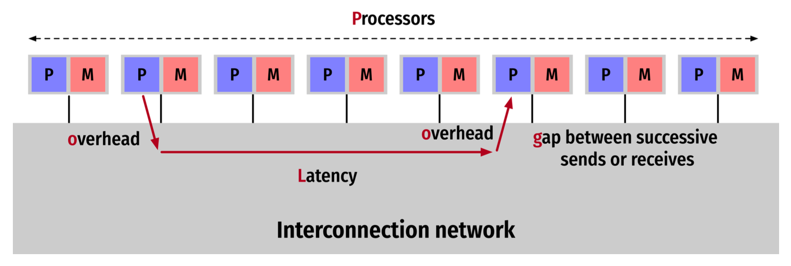

# Parallel Computing - Exam Questions

## Problem 1 (2 + 2 + 4 + 2 = 10 p)
### 1. What is the difference between task and data parallelism?
- Task parallelism
  - focuses on distributing tasks (distinct functions) across processors
  - those may work in the same or different datasets
- Data parallelism
  - involves distributing data across processors
  - the same operation is performed on different pieces of data

### 2. Explain MISD and MIMD.
- MISD (Multiple Instruction streams, Single Data streams)
  - a theoretical model where multiple instructions operate on the same data
  - not commonly used in practice
  - An example could be applying different filters to the same video frame simultaneously.
- MIMD (Multiple Instruction streams, Multiple Data streams)
  - allows for multiple autonomous processors to execute different instructions on different data
  - widely used in modern parallel computing environments, 
  - enabling diverse computational tasks to be performed in parallel, enhancing computing efficiency and speed

### 3. Explain the decomposition, assignment, and orchestration steps when creating parallel programs.
- decomposition involves dividing computation into tasks 
  - the objective is to identify portions of the computation that can be executed concurrently, considering the dependencies among tasks
- assignment distributes these tasks to workers
  - involves decisions about task scheduling, prioritizing tasks based on dependencies, and balancing the load among the processors to avoid bottlenecks
- orchestration manages data access, communication, and synchronization among processes, and mapping assigns processes to processors
  - includes synchronizing tasks to ensure that data dependencies are respected, managing communication between tasks, especially in distributed systems, and handling any runtime dynamics that may affect the execution order or the assignment of tasks

### 4. Is uneven load a problem when we create parallel programs? Motivate and explain what we can do to avoid it.
- uneven load can be a problem, leading to inefficiencies as some processors may remain idle while others are overburdened.
- strategies to avoid uneven load include dynamic workload distribution and load balancing techniques.
  - load balancing can be achieved through various strategies, such as work-stealing, where idle processors can "steal" tasks from busier processors, or 
  - by partitioning the problem domain in a way that allows for more flexible task assignment.

## Problem 2 (2 + 4 + 4 = 10 p)
### 1. Explain message-passing and shared memory.
- Message-Passing
  - processes communicate by explicitly sending and receiving messages
  - this model is well-suited for distributed systems where processes may run on different physical machines 
  - it provides a clear and structured way to handle communication but requires careful design to avoid deadlocks and ensure efficient data transfer
- Shared Memory 
  - the shared memory model allows multiple processes to access common memory spaces
  - this model is more intuitive for programmers as it resembles the traditional single-threaded programming model 
  - however, it requires mechanisms to ensure consistency and prevent race conditions, such as locks, semaphores, or barriers

### 2. Explain how we can automatically parallelise a program.
- term automatic parallelization can be misleading as a programmer still needs to provide hints or structure the code in a way that makes parallelization more straightforward for the compiler or runtime system
- the automatic part often refers more to the dynamic assignment of tasks to available processing units rather than the complete absence of manual intervention in the parallelization process
- while automatic parallelization aims to reduce the manual effort required to parallelize code, achieving optimal parallel performance often requires a blend of compiler/runtime support and intelligent guidance from the programmer
  - this can include using specific parallel libraries, adding annotations, restructuring code to make it more amenable to parallelization, and explicitly managing some aspects of task distribution and execution

### 3. Why is it difficult to automatically parallelise?
Automatic parallelization faces several challenges, 
- including accurately identifying independent tasks that can be executed in parallel, 
- dealing with data dependencies that limit parallelism, 
- and determining the most efficient way to distribute tasks and data across processors 
- Additionally, optimizing communication and synchronization among parallel tasks to minimize overhead and ensure correct execution is also a significant challenge.

## Problem 3 (5 + 2 + 3 = 10 p)
### 1. Explain ILP. What is it, what is its relation to parallel computing, and what issues are there?
- Instruction Level Parallelism (ILP) 
  - is the measure of how many of the operations in a computer program can be performed simultaneously 
  - reflects the ability of a processor to execute multiple instructions at the same time, without having to complete one instruction before starting the next 
  - is a key factor in the performance of a processor, exploiting parallelism that exists within a single program thread
  - Key concepts of ILP
    - Pipelining
      - is a technique where different stages of instruction execution (like fetching, decoding, executing, and writing back) are overlapped. 
      - that means that a CPU can have issued a command, but doesn't need to actively manage every step of that operation's execution after it's initiated (like a read or write operation to memory, or sending data to an I/O device)
    - Superscalar Execution
      - refers to the ability of a CPU to execute more than one instruction during a single clock cycle
      - CPUs have several execution units (arithmetic logic units, floating-point units, load/store units, etc.) that can operate in parallel, assuming the instructions are independent and there are no data hazards
      - its design allows it to decode and prepare several instructions for execution simultaneously, further enhancing its ability to process instructions in parallel
    - Out-of-order Execution
      - allows the CPU to pick and choose which instructions to execute next, based on availability of data and execution units, rather than following the program order strictly
      - if the CPU encounters an instruction that it can't execute right away (perhaps because it's waiting for data to be fetched from memory), it can execute another instruction that's ready to go 
      - this helps keep the CPU busy and improves efficiency
      - it is also beneficial in handling branch predictions and data dependencies more efficiently
        - if a branch prediction goes wrong, the CPU might need to discard or roll back executed instructions
  - Issues with ILP
    - **Data Hazards:** Situations where instructions that are scheduled to execute in parallel depend on each other's results, leading to delays.
    - **Control Hazards:** Caused by branch instructions (like if-else or loops) that can alter the flow of execution, making it hard to predict which instructions can be executed in parallel.
    - **Resource Conflicts:** Occur when instructions compete for the same resources (like memory or execution units), causing stalls.
    - **Diminishing Returns:** Beyond a certain point, adding more parallelism does not yield significant performance improvements, due to increased complexity and overheads in managing it.

### 2. Explain the memory wall. What is the issue and why do we consider it a "wall"?
The memory wall problem arises from the growing gap between the speed of CPUs and memory. As CPUs become faster, the relative latency of memory access becomes a significant bottleneck, causing CPUs to spend a considerable amount of time waiting for data from memory. This discrepancy limits the overall system performance and is referred to as hitting the "memory wall."

### 3. Give two examples of how we can reduce the impact of the memory wall.
To mitigate the impact of the memory wall, several strategies can be employed:
- Cache Optimization: Designing more efficient cache hierarchies and optimizing cache algorithms to maximize cache hits and minimize cache misses.
- Prefetching: Predictively loading data into cache before it is required by the CPU, reducing wait times for memory access.
- Memory Access Optimization: Optimizing algorithms and data structures to improve locality of reference, ensuring that data accessed in close temporal proximity is also close in memory, thereby reducing the frequency of slow memory accesses.

## Problem 4 (2 + 4 + 4 = 10 p)
### 1. GPUs are said to be SIMT. Explain.
- GPUs (Graphics Processing Units) are often described using the term SIMT, which stands for Single Instruction, Multiple Threads
- this concept is closely related to SIMD (Single Instruction, Multiple Data) from Flynn's taxonomy but with a key distinction that makes it uniquely suited to the architecture and processing style of modern GPUs
- SIMT architecture allows multiple threads to execute the same instruction but on different data 
- this is similar to SIMD in that a single operation is applied across many data elements in parallel 
- however, the SIMT model provides a more flexible approach that accommodates a wider variety of parallel patterns and data structures, characteristic of the diverse workloads GPUs handle, especially in graphics rendering and general-purpose computing (GPGPU tasks).
- Key Features:
  - **Thread Execution:** In SIMT, each thread can follow its own control flow. Even though all threads in a group (often called a warp in NVIDIA terminology or wavefront by AMD) execute the same instruction at any given cycle, individual threads can diverge, executing different branches based on their unique data.
  - **Efficiency and Flexibility:** This architecture strikes a balance between the efficiency of executing a single instruction across many data elements (like SIMD) and the flexibility to handle divergent paths and data-dependent control flows, making it particularly powerful for parallel algorithms.

### 2. Give examples of a problem that is suitable to solve on GPUs and one that is not. Motivate 
#### Suitable Problems
- Tasks with a high degree of data parallelism, due to their ability to execute many parallel threads efficiently.
- GPUs, with their SIMT architecture and parallel processing capabilities, excel at tasks that involve processing large amounts of data in parallel, where the same operation is applied to many data elements
  - matrix multiplication 
  - image processing
  - large-scale simulations 

- Graphics Rendering: The original and most obvious application of GPUs. Rendering involves computing the color and intensity of millions of pixels in parallel, a task GPUs are specifically designed for.
- Scientific Simulations and Numerical Analysis: Simulations that involve large matrices and vectors, like those found in physics simulations or climate modeling, can be significantly accelerated by GPUs. Operations like matrix multiplication and Fourier transforms benefit from the parallelism offered by GPUs.
- Deep Learning and Neural Networks: Training deep learning models involves a lot of matrix and vector operations, which can be parallelized efficiently on GPUs. The ability to process many operations in parallel significantly reduces training time for complex models.
- Image and Video Processing: Tasks like filtering, convolution, and transformation operations over large sets of pixels can be efficiently executed on GPUs due to their inherent parallelism.
- Data Analysis and Mining: Algorithms that can be expressed in parallel, such as sorting, searching, and pattern matching over large datasets, can be accelerated using GPU computing.

#### Unsuitable Problems
- Tasks with complex data dependencies, significant branching, or those that require extensive serial processing are less suitable for GPUs, as they cannot fully leverage the parallel processing capabilities of the GPU.
- Serial Tasks with Complex Dependencies: Tasks that involve operations which must be performed in a strict sequence, or where each step depends on the results of the previous step, are not well-suited for GPUs. The overhead of managing these dependencies often negates the benefits of parallel execution.
- Small Datasets: If the dataset is too small, the overhead of transferring data between the CPU and GPU memory can outweigh the performance benefits of parallel execution.
- Branch Heavy Logic: Algorithms that involve a lot of divergent branches (if-else conditions that differ widely across data elements) can lead to inefficiencies on GPUs. While SIMT architectures can handle divergence to some extent, excessive divergence can reduce the efficiency of parallel execution.
- Tasks with High I/O Latency: If a task is bottlenecked by input/output operations, such as reading from or writing to disk, then accelerating the computation on a GPU might not result in a significant overall performance gain.

#### Motivation
The motivation behind selecting suitable tasks for GPU acceleration lies in maximizing computational efficiency and reducing processing times. By leveraging the parallel processing capabilities of GPUs for appropriate tasks, applications can achieve significant performance improvements. For example, in deep learning, using GPUs can reduce training time from weeks to days or even hours, enabling more rapid development and experimentation. Similarly, in scientific simulations, GPUs can handle complex calculations over large datasets more efficiently than traditional CPUs, accelerating research and discovery.

### 3. What is a warp? What is important to consider when we use warps?
Architecture of a GPU
- **Streaming Multiprocessors (SMs):** A GPU contains multiple SMs, each of which can execute instructions independently. SMs are the primary building block of a GPU and are designed to handle thousands of threads concurrently.
- **Streaming Processors (SPs):** Within each SM, there are numerous SPs (also referred to as CUDA cores in NVIDIA GPUs or Stream Processors in AMD GPUs). These SPs execute the actual instructions and are responsible for the heavy lifting in data processing.
- **Warp/Wavefront Execution:** The threads are grouped into warps or wavefronts, with each group executing the same instruction at the same time on different data elements. If threads within a warp follow different execution paths due to branching, the warp can temporarily diverge, handling each branch separately before reconverging, which can impact performance.

  - In GPU computing, a warp is the basic unit of thread execution. It consists of a group of threads (typically 32 in NVIDIA GPUs) that execute the same instruction on different data elements simultaneously. Warps allow GPUs to achieve high levels of parallelism. When programming for GPUs, it's important to minimize warp divergence – scenarios where threads within the same warp follow different execution paths – as it can lead to underutilization of the GPU's computing resources.

  - A warp is a group of 32 threads (unchanged between generations)
  - It is the unit of thread management, scheduling, and execution
  - Each thread (in a warp):
    - Start at the same program address
    - Has its own program counter and registers
    - Can branch and execute independently

  1. SM receives thread block
  2. SM partitions thread block into warps
     - 0, 1, … within each warp
  3. The warp scheduler schedules warps to run
  4. The scheduled warp executes one common instruction at a time (SIMD)

  - Max efficiency if all threads execute the same path
  - If paths diverge across threads
    - Execute each path serially
    - Threads not on that path disabled (temporarily)
    - Threads converge when all paths complete
  - Multiple warps can run at the same time, independently
    - Depends on the number of warp schedulers
    - Paths diverge only within a warp
  - Execution context stays on-chip
    - PC
    - Registers
    - Shared memory
  - Context switches are free, can switch each clock cycle
  - At instruction issue time, the scheduler:
    - selects a warp with active threads
    - issues instruction to the warp’s threads
  - The number of blocks/warps that fit on an SM depends on:
    - Registers and memory required by each kernel
    - Registers and memory available on the SM
- **Memory Hierarchy:** GPUs also feature a complex memory hierarchy, including global memory, shared memory (accessible by threads within the same SM), and registers (private to each thread). Efficient use of this memory hierarchy is critical for achieving high performance on GPU architectures.

## Problem 5 (3 + 2 + 3 + 2 = 10 p)
### 1. Why is PRAM an unfeasible model?

- The interconnection network between processors and memory would require a very large area
- The message routing would require time proportional to the network size

### 2. Explain EREW and CREW in PRAM

- EREW (Exclusive Read Exclusive Write)
  - No concurrent read/writes to the same memory location
- CREW (Concurrent Read Exclusive Write)
  - Multiple processors may read from the same global memory location in the same instruction step

### 3. Explain Common, Arbitrary, Priority, and Common for CRCW in PRAM

- COMMON, all processors that write into the same memory address must write the same value
- ARBITRARY, one processor is chosen randomly and its value is written
- PRIORITY, the processor with the highest priority’s value is written
- COMBINING, some combination, e.g., max, min, etc is written
- COMMON is most often used

### 4. Explain Isoefficiency.
Isoefficiency is a measure of how the problem size needs to scale with the number of processors to maintain a constant efficiency. It's a key concept in evaluating the scalability of parallel algorithms. An algorithm with good isoefficiency can handle larger problem sizes efficiently as the number of processors increases, making it well-suited for parallel execution on systems with varying numbers of processors.

- How much must the problem size increase to retain the same efficiency on when the number of processors increase?
  - A way to quantify scalability
- Remember, efficiency is defined as $\frac{T_1}{pT_p}$ or $E_p=\frac{S_p}{p}$.

## Problem 6 (3 + 3 + 4 = 10 p)
### 1. Explain the Karp-Flatt metric. How is it defined and how do we use it?
The Karp-Flatt metric is a quantitative measure used to estimate the serial fraction of a parallel program. It helps to identify the portion of a program that limits its parallel scalability. The metric is calculated using the formula $e=\frac{\frac{1}{S_p}-\frac{1}{p}}{1-\frac{1}{p}}$, where $S_p$ is the observed speedup with $p$ processors, and $e$ is the estimated serial fraction. This metric is valuable for diagnosing performance bottlenecks and understanding how effectively a program utilizes parallel

- Amdahl’s and Gustafson–Barsis’s laws can overestimate the speedup since they ignore the overhead from parallelisation
- The Karp-Flatt metric is considered as another kind of inherently sequential work, so Amdahl’s law can be used to determine a combined serial fraction, $e$

### 2. How do we estimate the time for a superstep in BSR?
In the Bulk Synchronous Parallel (BSP) model, the computation is divided into supersteps, each consisting of computation, communication, and a barrier synchronization at the end. The time for a superstep can be estimated by considering the maximum computation time among all processors, the communication time (based on the number of messages sent and received and the network bandwidth), and the synchronization time. The BSP model allows for predictable performance analysis by making the costs of computation, communication, and synchronization explicit.

#### BSP 
- Bulk Synchronous Parallelism
- A parallel programming model that uses SPMD style
- Supports both direct memory access and message-passing semantics

##### A BSP Computer
- A set of processor-memory pairs
- A communication point-to-point network
- A mechanism for efficient barrier synchronization of all processors

##### BSP supersteps
- A BSP computation consists of a sequence of supersteps
- In each superstep, processes execute computations using locally available data, and issue communication requests
- Processes synchronized at the end of the superstep, at which all communications issued have been completed

### 3. Explain LogP.
The LogP model is a more realistic model for parallel computation that takes into account the limitations of real-world systems, including Latency (L) of communication, Overhead (o) for sending and receiving messages, the Gap (g) between messages (inverse of bandwidth), and the number of Processors (P). The LogP model is used to design and analyze parallel algorithms by providing a framework to account for communication delays and processing overheads, making it possible to predict the performance of parallel programs on distributed-memory architectures more accurately.

#### LogP
- Processing
  - Powerful processor, large memory, cache, …
- Communication
  - Latency
  - Limited bandwidth
  - Overhead
- No consensus on a programming model, should notenforce one
- Latency in sending a (small) message between modules
- overhead felt by the processor on sending or receiving message
- gap between successive sends or receives (1/BW)
- Processors

##### LogP "Philosophy"
- Concerns
  - Mapping N words onto P processors
  - Computation within a processor
  - Communication between processors
- Characterise processor and network performance …
- … without thinking about what is happening within the network
- Values for g and l determined for machines, e.g.,
  - Cluster, g=40, l=5000-20000

