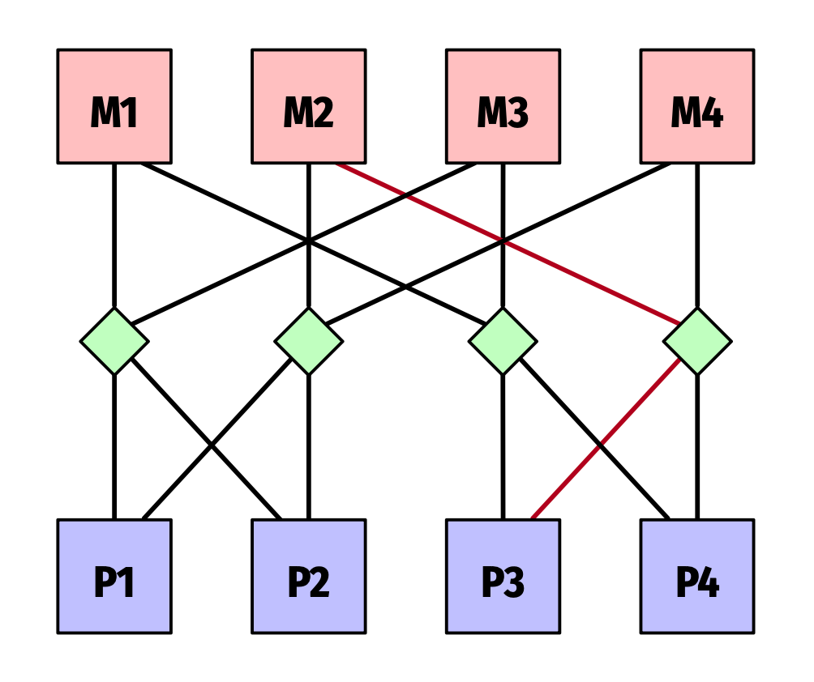

# Parallel Computing 

## Introduction
- **Importance**: Addresses limitations of Moore's Law and Dennard scaling, leveraging multiple processing units.
- **Challenges**: "Power wall," "memory wall," and ILP limitations necessitate parallel approaches for performance improvements.

- Dennard scaling broke down around 2005-2007
  - At small (transistor) sizes, current leakage poses greater challenges
  - causes the chip to heat up, which creates a threat of thermal runaway
- So, increases in clock speed slowed down
  - 50MHz in 1990 (Intel)
  - 3.8GHz in 2005 (Intel)
  - 4.8GHz in 2020 (Intel, single core boost)
- “Power wall”

### Pipelining
- Attempts to keep the CPU busy …
- … by dividing instructions into sequential steps …
- … that use different units.
- Parallel execution on the instruction level

Also affected by walls 
- ILP(Instruction-level parallelism) increases complexity …
  - … and can only do so much
- Caches exploit data locality …
  - … and there is only so much of that
- Also, memory speed is not increasing as fast as CPUs
  - … so CPUs are spending much time waiting for data
- So, ILP, Cache, and Memory walls!


## Parallel Computing Architectures
- **Instruction-level Parallelism (ILP)**: Exploiting parallel execution with techniques like pipelining and SIMD.
- **Cache and Memory**: Optimization requires understanding of cache hierarchies and strategies to mitigate performance issues.

### Power wall 
The power consumed by a processor is: 

$$
Dynamic \; power \propto capacitive \; load \times voltage^2 \times frequency
$$

- high power results in high heat 
  - so power is a design constraint, thermal design poer (TDP)

Other walls:
- Processor 
- ILP
- Memory
- Cache

### Simple Overview 
The CPU executes instructions. These are stored in memory together with data. I/O is used to interact with external devices (and users) 
-> Von Neumann Architecture

### Components and buses


### Memory types
- Memory can be Random Access (RAM) or Read Only (ROM).
- Memory is generally organized hierarchically, from fast and expensive (and generally small) to cheap and slow. We differentiate registers, cache (often in many levels), primary memory, and secondary memory.
  - Note that secondary memory can differ in speed as well (e.g., 1TB SSD, 8TB HDD).

### How do we introduce control flow? 
- We use various test and jump/branch instructions to control the flow of a program.
- Each instruction is stored in memory, and we can freely jump to any point in memory. We basically change the program counter.
- Jump/branch instructions can be unconditional or conditional (for example, branch equal or branch not equal). The conditional branches rely on the status register.

### ISA 
The instruction set architecture (ISA), is an abstract model of a computer.
It describes: 
- the supported data types
- the state (e.g., memory and registers)
- the semantics (e.g., addressing modes)
- the instruction set
- the I/O model
An ISA can be implemented in different ways; for example, both Intel and AMD support the x86-64 ISA.

### Instruction-level parallelism (ILP)

#### Pipelining 
- Multiple instructions are overlapped in execution
- Increases instruction throughput
- Does not reduce the time it takes to complete a single instruction
- Used in most microprocessors

#### Challenges 
Hazards, when the next instruction cannot execute in
the following clock cycle:
- Structural Hazard
- Data Hazards
- Control Hazards

##### Structural hazard
- A planned instruction cannot execute in the proper clock cycle
- The hardware does not support the combination of instructions that are set to execute.
- For example, if in the laundry example:
  - Combined washer and dryer

##### Data hazard 
- A planned instruction cannot execute in the proper clock cycle
- Data that are needed to execute the instruction are not yet available.
  - Data dependencies
- Can stall (bubble) the pipeline

##### How can we avoid data hazards? 
- Program (compiler) should arrange instructions to avoid such dependencies
- Will not avoid all hazards
- Forwarding/bypassing
- The missing data element from internal buffers
- Rather than waiting for it to arrive from programmer-visible registers or memory
- Solves some data hazards

##### Control (branch) hazard
- When the proper instruction cannot execute in the proper pipeline clock cycle
- The instruction that was fetched is not the one that is needed
- The flow of instruction addresses is not what the pipeline expected
- Predict which branch will be taken to avoid stalls
  - Flush if wrong

##### Branch prediction 
- A method of resolving a branch hazard
- Assumes a given outcome for the conditional branch
- Proceeds from that assumption rather than waiting to ascertain the actual outcome
- Dynamic (hardware) predictors

##### Dynamic Branch prediction
- Prediction of branches at runtime using runtime information
- Branch history table
  - A small memory that is indexed by the lower portion of the address of the branch instruction
  - Contains one or more bits indicating whether the branch was recently taken or not
  - Simplest sort of buffer

##### Problem with 1-bit
- Fails on the first and last iteration
  - 80% correct (but branch is taken 90% of the time)
- Should match frequency for highly regular branches
  - So, we want 90% correct
- Solution, more bits
  - Weaken belief, not change it

##### Branch prediction 
- In reality, much more advanced
  - Consider both global and local behavior
  - Correlating
  - Tournament
  - ...
- Additional hardware to cache destination PC of prediction
  - table on stores prediction, not where to continue
  - so, requires calculation

##### Instruction-level parallelism
- Pipelining exploits the potential parallelism among instructions
- Two ways to increase parallelism
  - Deeper pipelines to overlap more instructions
  - Multiple issue, components are replicated so multiple instructions can be launched in every pipeline stage
- Multiple issue allows instruction rate to exceed clock
rate
  - Super-scalar

##### CPI and IPC 
- Clock cycles per instruction
- Instructions per clock cycle
- Example: 3GHz processor with 4-way multiple issue
  - CPI is 0.25
  - IPC is 4
  - (assuming 1 clock cycle per instruction)

##### Static multiple issue
- The compiler packages instructions and handles hazards
- Issue packet, one large instruction with multiple operations
- Very Long Instruction Word (VLIW)
  - Style of ISA that launches many operations that are defined to be independent in a single-wide instruction
  - Typically with many separate opcode fields

##### Compiler can help 
- Compiler can transform the code to be more parallel
- For example, loop unrolling
  - Multiple copies of the loop body are made
  - Instructions from different iterations are scheduled together
  - Can increase the ILP available

##### Dynamic multiple issue 
- Processor decides how many and which instructions to issue in each stage
  - Simplest case, in order
  - Hardware guarantees correct execution
- Dynamic pipeline scheduling
  - Chooses instructions to execute next
  - Can re-order to avoid stalls
- Three major units:
  - An instruction fetch and issue
  - Multiple functional units
  - A commit unit

- Out-of-order execution that preserves the dataflow
  - Functional units can start when the data they need is available
- Fetch and decode in-order to track dependencies
- In-order commit to write results to registers and memory in program fetch order.

##### New type of hazard 
- Name dependence
- Two instructions use the same register or memory location
- There is no flow of data between the instructions associated with that name

1. An antidependence between instructions *i* and *j* occurs when instruction *j* writes a register or memory location that instruction *i* reads. The original ordering must be preserved to ensure that *i* reads the correct value.
2. An output dependence occurs when instructions *i* and *j* write the same register or memory location. The ordering between the instructions must be preserved to ensure that the value finally written corresponds to instruction *j*.

##### Pipeline hazard 
- A name or data dependence between instructions exists
- Instructions are close enough that the overlap during execution would change the order of access to the operand involved in the dependence.

##### Three kinds 
1. An anti-dependence can lead to a write-after-read (WAR) hazard.
2. An output dependence can lead to a write-after-write (WAW) hazard.
1. A true data dependence or a read-after-write hazard.

##### Multiple issue problems
- Sustaining that issue rate is very difficult, so even with 4 or 6 issue, few applications can sustain more than 2 instructions per clock cycle.
- True data dependencies may limit ILP
- Can be difficult to determine whether true or not, so conservative approach
  - Aliasing
  - Distance
  - …
- ILP wall
- The memory hierarchy limit the ability to keep the pipeline full
  - ILP helps hide memory stalls, but limited ILP means not all can be hidden

#### Hardware Multithreading

##### Thread-level parallelism (TLP) 
- Runs more than one thread of execution simultaneously
  - Instructions from all threads can be executed in the pipeline
  - Can increase ILP and help hide memory stalls

##### Remember from OS knowledge
- A process represents “the computer”
  - CPU, memory, resource, etc
- A process represents “the processor”
  - Execution context, e.g., registers, PC, …
- Threads can run with round-robin style interleaving
- Execution context switches? Can be solved on multiple issue dynamic scheduling.

##### Performance
- Multithreading increase throughput, not single-thread performance
  - Can decrease, by running multiple threads instead of a single
- Small, if any, increase in energy costs (simple exploiting already existing ILP)
  - Not entirely true, but…

#### Vector operations (SIMD)

##### Vector architecture 
- Simple idea
  - Operate on vectors (compound values) rather than scalars (single values)
- SIMD
  - Vector registers
  - Vector instructions

##### The data does not match the vector register size?
- There is a max vector length (mvl) for the vector registers
- Vectors in real programs are unlikely to match the mvl
  - Often unknown at compile time
- Use vector length register or specific instructions to deal with shorter vectors
- Use “strip mining” to deal with larger
  - Divide vector into mvl (or smaller) pieces and operate on these

##### Vectors and conditional statements 
```python
for(i=0; i<64; i=i+1):
    if (X[i] != 0):
        X[i] = X[i] - Y[i]
    else:
        X[i] = X[i] + Y[i];
```

- Vector operations should only operate on part of the vector (where the if-statement is true)
- Can be solved with a vector mask that determines which indices should be included
- The functional units for indices that are not included are idle
- If is executed before else, so potentially many nops
- What if no else and very few matches?
  - Can be slow, perhaps execute without vector ops?

##### Other
- Loads and stores are generally more expensive than for scalars
  - Can be distributed among multiple banks
- Strides can be used to handle multi-dimensional arrays
  - But makes the memory system more complicated
- Sparse matrices can be handled by gather/scatter operations
  - Use an index vector to gather a dense vector with the values in the sparse matrix
  - Expanded with scatter, using the same index vector

#### Multicore 

##### Now what again? 
- Vector/SIMD operations useful and can speed up certain classes of programs significantly
  - Especially GPUs
- But, not all problems are suitable for SIMD
- MIMD left
  - Multiple processing cores

##### Multicore / multiprocessing 
- Free lunch is over; this requires new programming models
  - Existed in multiprocessor systems, but now everywhere
  - Which requires a fundamental change, not “niche”
- New computer architecture challenges
  - Latency (from “communication”)
  - Shared memory, consistency models

##### Task parallelism
- Focuses on distributing tasks to processors (cores)
  - Such as threads or processes
- The tasks generally do different things …
- … on the same or different data
- Tasks are not necessarily independent of each other
  - Shared resources, for example

##### How would we parallelise? 
- in python through a `ThreadPoolExecuter(max_workers=8)`

##### Data parallelism 
- Distribute data
- The data is operated on in parallel
- Same program, generally different data

##### Flynn’s taxonomy
- Single Instruction stream, Single Data stream (SISD)
- Single Instruction stream, Multiple Data stream (SIMD)
- Multiple Instruction stream, Single Data stream (MISD)
- Multiple Instruction stream, Multiple Data stream (MIMD)


##### Extension to programs 
- Single Program
- Multiple Program
- Single or Multiple Data
  - E.g., SPMD, MPMD

##### Somewhat simplified
- First example, MISD (or MPSD)
- Second example, MIMD (or MPMD)
- Third example, SIMD
*Do you agree?*

#### Programming models?

##### Things to cosider 
- Naming
- Operations on named things
- Ordering of operations
- Communication and replication

##### Concrete 
- Shared address space
  - Natural way of programming
  - Think of loads and stores as communication
  - Hard to get right, hard to get performant
- Message passing
  - Nothing shared
  - Communication via explicit messages
  - Hard to get right, think of what needs to be passed as messages
- Data parallel
  - Map computations to a collection of data
  - Think of operations on n-dim arrays
  - Assumes shared address space
  - Limits communications between iterations

##### in practice 
- Combination of shared address space and message passing
- Shared address space with a node
  - Multi core and processor
- Message passing between nodes
  - Over some kind of interconnect (network)
- Data parallel in CPUs or via accelerators
  - Again, we will get there…

##### Creating a parallel program
1. Decomposition of computation into tasks
2. Assignment of tasks to “workers” (not a great name)
3. Orchestration of the necessary data access, communication, and synchronisation among processes
4. Mapping of processes to processors

 

##### Note: n-dim arrays
- It can be helpful to reshape n-dim arrays when decomposing and assigning
- For example, a `(12, 18, 3)` array can be considered as `(216, 3)` or `(648)`
```python
np.zeros((12, 18, 3)).reshape(216, 3)
```

- Why shape `(8, 27, 3)` for average pixel value?
  - We need to chunk, so use #processors
- Why shape `(216, 3)` for grayscale conversion?
  - Can operate on a single pixel, so simplest implementation
  - Can chunk this as well, e.g., same shape as average pixel value
  - But, we trust the system to optimize the mapping
to actual processors

##### Difference 
- all three algorithms require in the range of $N^2$ operations
  - So, time is approximately $3N^2$
- Parallel require slightly more operations, but executed in parallel
  - Assume $P$ processors
  - Average pixel takes $N^2 / P+P$
  - Grayscale takes $N^2 / P$
  - So, time is approximately $3N^2 / P+2p$
- Speedup approaches $P$ if $N ≫ P$

##### What if there are dependencies?
- 2D-grid based PDE solver
- $(N + 2)^2$ grid
- Iterative solution
- Gauss-Seidel sweeps until covergence
- A element is the mean of it and its neighbors

##### Serial implementation
```python
def solve(grid, tol):
    done = False
    while not done:
        diff = 0
        for i in range(1, grid.shape[0]-1):
            for j in range(1, grid.shape[1]-1):
                prev = grid[i, j]
                grid[i, j] =    (grid[i+1, j] + grid[i, j-1] + \
                                 grid[i-1, j] + grid[i, j+1] + \
                                 grid[i, j]) * 0.2
                diff += abs(grid[i, j] - prev)

        if diff/(grid.shape[0]-2)**2 < tol:
            done = True
```

##### Decomposition
- Can be parallelised, but …
- Uneven load, low at the beginning and end
- Frequent synchronization (after each diagonal)

Dependencies | Decomposition
:-----------:|:------------:
 | 

##### Can we do better?
- A common way to improve is to change to an algorithm that is easier to parallelise (even if it is slower)
- We can change the order grid elements are updated
- Approximation, and the new order converges to a solution within the error threshold
- Not necessarily the same, but still valid
- Requires domain knowledge

##### New approach
Red-black / chessboard strategy | New Order
:------------------------------:|--------
 | 1. Update all red elements <br> 2. Update all black elements <br> 3. Repeat until convergence

##### Synchronisation (remember!)
- Locks and semaphores
  - `acquire()` and `release()`
- Barriers
  - `wait()`


## Memory in Parallel Computing
- **Memory Hierarchy**: Crucial for writing efficient parallel programs is understanding memory structure and access.
- **Cache Coherence and Consistency**: Maintaining data consistency across caches is vital for program correctness.

### Should this not be simple?
- Sequence of bytes
- Random access, read and write

### Unfortunately not...
- Speed
- Channels
- Sockets
- Caches

### Channels / memory controllers
- Most modern CPUs have more than one memory channel
- The AMD CPU has eight
- So, when enough memory modules are installed, multiple transfers can happen in parallel
- So, 8 * 25.6GB/s (204.8) in theory

### Memory modules 
- Memory (contents) can be organized into modules in two different ways:
  - High-order interleaving: consecutive words are in the same modules
  - Low-order interleaving: consecutive addresses are in different modules
- For example, assume 1024 words and four modules:
- High-order: M0 0-255, M1 256-511, M2 512-767, M3 768-1023
- Low-order: address 0, 4, 8, 12, … in M0, 1, 5, 9, 13, in M1, ...
- Why high and low order?
- Assume eight modules:
  - In high-order, the first three bits of the address indicate module
  - In low-order, the last three bits of the address indicate module

### Why do we need to take care?
- Assume low-order, one address per word, and found modules
- Also assume that all threads are synchronized and try to access memory at the same time
- 0, 1000000, 2000000, etc. all have the same bits, so they all map to the same module
- This means that we have read conflicts, which result in slowdowns
- We can add a stride or padding to reduce conflicts

### Sockets 
- The previous is per CPU (shared by the cores/threads)
- In multi-CPU (socket) systems, the channels are per CPU
  - So, a two-socket system would have 16 channels…

### Single bus 


### Crossbar


### Butterfly


### NUMA 
- Multiple sockets, unfortunately, often means that memory modules are tied to a specific CPU
- To access that memory, the request needs to be forwarded to and handled by the correct CPU
- Non-Uniform Memory Access
- (This is also true for I/O, NUMA I/O)


#### NUMA and interleaving 
- Bad access patterns can be expensive
  - Multiple steps
  - High-load on buses
- Ideally, access memory “near” the core

### Caches 
- Small and fast memory, close to the CPU
- Stores copies of data that is frequently used
  - Locality
- Instruction, data, or unified
- Often in hierarchies

### Memory hierarchy (illustration)


### Latency 
- Varies from CPU to CPU, but the numbers below (AMD Epyc) should illustrate the difference
  - L1 32KB instruction and data, private, 4 cycles (1.18ns) latency
  - L2 512KB unified, private, 13 cycles (3.86ns) latency
  - L3 256MB unified, shared, avg. 34 cycles (10.27ns) latency
- RAM, ~130ns latency

### Why split L1?
- Instruction and data can conflict/trash each other if unified
- IF and MEM are different stages in the pipeline
  - where should a unified cache be placed?

### Issues
- Cache hit is cheap
- Cache miss is expensive
- So, locality
  - But, cache is limited

### Cache hit and miss 
- Hit time, the time it takes to read from the cache
- Miss time, the time it takes to copy data from memory to the cache
- Miss rate, the percentage of cache misses
- Average memory access time
  - hit time + (miss rate * miss time)
- Since miss time is much larger than hit time, even a low miss rate can have a big impact
  - 1.18 * (0.50 * 130) ~= 66
  - 1.18 + (0.25 * 130) ~= 34
  - 1.18 + (0.05 * 130) ~= 8
- So, improve miss rate or miss time…
- Of course more complicated in reality (several levels)

### Cache sizes and associativity
- Can a 32KB (data) cache store any 32KB memory?
  - No, generally not
- Associativity
  - Where can data be stored in the cache
- Cache lines
  - Data is stored by line (of some size) rather than individual bytes

### Direct mapped cache


### N-way and fully associative
- In a fully associative cache, any memory chunk can be mapped to any entry
  - Full cache needs to be checked for a hit
- In an N-way associative the cache is divided into N sets
  - A chunk of memory is mapped to a set
  - But, any entry in that set


AMD: 8-way associative, 64-byte cache lines (8 * 64-bit words)

### Why not fully associative?
- Requires more memory
  - Tag must hold full address
- Slower to search / requires more hardware
  - Must search the entire cache to check if an address is in it or not

### Why cache lines?
- Spatial locality
  - We might access memory addresses near the previously accessed memory
- Iterate over an array, access fields in a struct/object, etc.

### Cache replacement strategies
- In direct mapped, no choice
- Many algorithms exist
- For example, least recently used
- Can affect performance, depending on how well replacement maps to use
- For example, time vs frequency

### Caches and writing 
- Data can be written directly to memory (no write)
  - Cached copy can be updated (write though)
- Or just to cache (write back)
  - To memory when replaced
- Pros/Cons: 
  - Write back is faster
  - But more complicated

### Cache coherence 


- Orderings of operations from multiple processors to the same memory location
- Local ordering of accesses to each cache block

### Remember 
- Von Neumann model
- Sequential access specified by the program
- Out-of-order execution follows the program order
- In MIMD/Shared-memory, sequential access is not guaranteed to be true
  - Unless synchronization forces sequential consistency
  - (A result that is consistent with sequential access)

### Solutions to coherence
- Directory
  - Caches request blocks
  - Directory keeps track of which caches have which blocks
- Snoopy bus
  - Processors observe other processors’ actions

#### Directory 
- A directory with P+1 bits for each block
  - P caches and one exclusive bit
- If read a block, set bit for block
- If write, invalidate other copies and reset their bits
- Exclusive means exclusive access to block

|1|2|
| :-----: | :------: |
|  |  |


#### Snoopy Bus
- All caches snoop all other caches’ RW requests and keep cache blocks coherent
- Each cache block has coherence metadata attached
- Easy to implement on a shared bus
  - Each cache broadcasts RW on the bus
- Scalability issues; works better on smaller systems

##### MSI Protocol
- A cache block can be in three different states
  - Invalid (not available)
  - Shared (available in at least one cache, clean)
  - Modified (available in (only this) cache, dirty)
- Read miss Block A, Read request on bus, State S
- Write miss Block A, Read exclusive request on bus, State M
- If processor sees Read exclusive on bus, State I
  - What if in State M?

###### Problem with MSI?
- When clean always in S
  - No matter if it is the only copy
- MESI extends with Exclusive state
  - Only one cache holds the value
  - So, no need to invalidate others on write

#### Snoopy vs Directory
- Snoopy
  - Simple, but not scalable
  - Short miss latency, bus transaction to mem
  - Bus provides global serialization
- Directory
  - Complex
  - Scales well, storage for directory
  - Indirection adds to miss latency

### False Sharing 
- State is per block / cache line
  - E.g., 64 bytes (8 64-bit values, 16 32-bit, …)
- What if two different processors modify different parts of the same block?
  - No different, block becomes modified / invalidated
- Can ping-pong between caches
  - Reduces performance

### Dealing with caches
- Simple in theory
  - Locality
  - Working set should fit in cache
  - Avoid, e.g., false sharing

|Iteration  |Iteration with stride|
| :-------: | :-----------------: |
|  |  |

### Matrix row or column & threading


```python
for i in range(row):
    for j in range(col):
        s += mat[i][j]
```

```python
for i in range(col):
    for j in range(row):
        s += mat[i][j]
```

If we process the matrix by *row-column* , we have a 0.25 miss rate. If we do it *column-row* , we have a 1.0 miss rate
Assume we write to the matrix. If we process a row per thread, everything is ok. If we process a column per thread, we risk false sharing

### Matrix multiplication

We want to compute $C=A*B$. Assume that A, B, and C are $N$ by $N$ matrices.

```python 
# kij-order - misess per iteration: 
# A = 0.00, B = 0.25, C = 0.25 
for k in range(N):
    for i in range(N):
        r = A[i][k]
        for j in range(N):
            s += r * B[k][j]
            C[i][j] = s

# ikj-order - misses per iteration:
# A = 0.00, B = 0.25, C = 0.25
for i in range(N):
    for k in range(N):
        r = A[i][k]
        for j in range(N):
            s += r * B[k][j]
            C[i][j] = s

# jki-order - misses per iteration:
# A = 1.00, B = 0.00, C = 1.00
for j in range(N):
    for k in range(N):
        r = B[k][j]
        for i in range(N):
            s += r * A[i][k]
            C[i][j] = s

# kji-order - misses per iteration:
# A = 1.00, B = 0.00, C = 1.00
for k in range(N):
    for j in range(N):
        r = B[k][j]
        for i in range(N):
            s += r * A[i][k]
            C[i][j] = s
```

### Summary matmul 
- ijk and jik result in 1.25 misses per iteration
- kij and ikj result in 0.50 misses per iteration
- jki and kji result in 2.00 misses per iteration

#### Does it matter in practice? 
Time to multiply two 1024 by 1024 matrices in seconds

Run | ijk   | jki   | ikj 
--  | --    | --    | --
1   | 0.97  | 1.64  | 0.66
2   | 0.98  | 1.60  | 0.66
3   | 0.98  | 1.62  | 0.66
4   | 0.98  | 1.65  | 0.66
5   | 0.98  | 1.63  | 0.66

### Cach size? 
- Assume ijk
  - Reads $N^2$ elements of B,
  - $N$ elements of one row of A repeatedly
  - Writes $N$ elements of one row of C
- This should ideally fit in the cache

### Blocking and recursive
- We can compute matrix multiplication recursively on parts of the matrix
- We stop recursing when we “fit the cache”


#### Improvement?
Time to multiply two 1024 by 1024 matrices in seconds

| Run | 16   | 32   | 64   | 128  | ikj  |
| --- | ---- | ---- | ---- | ---- | ---- |
| 1   | 0.51 | 0.44 | 0.43 | 0.50 | 0.66 |
| 2   | 0.51 | 0.44 | 0.43 | 0.49 | 0.66 |
| 3   | 0.51 | 0.44 | 0.43 | 0.50 | 0.66 |
| 4   | 0.51 | 0.42 | 0.43 | 0.50 | 0.66 |
| 5   | 0.50 | 0.42 | 0.43 | 0.51 | 0.66 |

## Sum and scan

### Remember: concurrent vs parallel
- Concurrency is about structure
- Parallelism is about execution
- For the algorithms so be beneficial
  - Parallelism to execute
  - Concurrency to structure

### PRAM
- Parallel Random Access Machine
- Shared-memory multiprocessor model
- Unlimited number of processor with unlimited local and shared memory
- Each processor knows its ID
- Inputs and outputs are placed in shared memory
- Each instruction takes unit time
- Instructions are synchronised across processors
- Unfeasible model
  - The interconnection network between processors and memory would require a very large area
  - The message routing would require time proportional to the network size
- Theoretical model
- Algorithm designers can forget about communication and focus on the parallel computation
- We will revisit it later!

### Many issues 
context: computing the sum by splitting the list into chunks w/o parallelization
- We assume one processor per element
  - So eight processors for eight elements
- We cover races/sync by starting and stopping threads
  - This is equivalent to a barrier
  - but slower…
  
### A more practical approach 
1. Split the array into one part per thread
2. Compute the sum for each part
3. Sum the sums of the parts

### Prefix Scan
- Computes all partial sums of a vector of values
- Inclusive and exclusive
  - Exclusive does not include “current” value
- Just as parallel sum, any associative combining operation can be used


```python
l = [3, 5, 2, 5, 7, 9, 4, 6]
ps = [0, 0, 0, 0, 0, 0, 0, 0]

ps[0] = l[0]
for i in range(1, len(l)):
    ps[i] = ps[i - 1] + l[i]

print('prefix scan:', ps)
```
```log
prefix scan: [3, 8, 10, 15, 22, 31, 35, 41]
```

#### A practical approach 


## Sorting

### Implementing Bubble Sort in parallel
- Split the array into *N* chunks (where *N* is the numberof threads)
- Sorting on each chunk in parallel
- Challenges
  - Did we swap? Shared
  - The two phases (odd/even) should not overlap

#### Example Implementation fails 
context global `offs` and `exch` bool + `while` loop
- Problem with shared variables? Yes
  - Assignment in Python is atomic
  - All write the same value, so no race with flag
  - But offset is problematic!
- The threads can (and will) get out of sync
  - Some threads might not even enter the while-loop

| Fails | Solution |
| :---: | :------: |
|  |  |

### Trying to paralellize quicksort - terrible approach
- How many threads will be created? Many!
- Why is that a problem?
  - Limit to number of threads
  - High overhead from creation
- Generally more difficult to deal with recursive algorithms

#### Easier to parallelize? 
- We use a queue instead of recursion
- Each call to partition is independent, so …
- … we can run them in parallel
- Rather than spawning threads for the calls, …
- … existing threads grab “jobs” from the queue

#### Unfortunately...
- … it is a bit more complicated
- How do we know when we are done?
- We should not make timing assumptions
  - E.g., end when there is nothing in the queue for a while
- So, we need a flag …
- … that is set once all elements are sorted

### Summary 
- We can implement parallel for-loops by
  - Chunking
  - Offset based on thread id
- Barriers are useful to synchronize the execution
- Locks, semaphores or events can be used to signal threads / control execution
- Thread id can also be used if something should be serial
  - Best used in combination with the other tools

#### Common building blocks
- Reusable building blocks
  - Prefix sum/scan
  - “Parallel for” (in Python/Java)
- Can be annoying to interleave sync
- Can be slower without interleaving
  - Since more syncronization, which has overhead

## Graphs 

### Remember graphs...


### Concurrent DFS?
- We use a recursive algorithm
- The graph is shared, but read-only
- `marked` and `edge_to` are shared and read-write

### Takeaways from first parallel version
- The queue can be empty at times, causing threads to exit prematurely
- if … continue inside a lock is a really bad idea
- We can get rid of one of the if marked/if not marked checks

### Working with locks and semaphores 
- Many locks in large graphs
- Waste of resources
- We will most likely not access all vertices at once
- But, an idea we can work with

### Prim's algorithm (MST)
- Prim’s algorithm is sequential
  - We add one edge per iteration
  - Which edges are available to add depends on the previous iteration
- No need for exhaustive search, we know which edgeto add
- But, we can improve how we find that edge


### Remember parallel reductions
- We can replace the heap with a parallel reduction
- Find the minimum weight across a large list of edges

### Remember: n-dim arrays 
- It can be helpful to reshape n-dim arrays when decomposing and assigning
- For example, a `(12, 18, 3)` array can be considered as `(216, 3)` or `(648)`
```python
np.zeros((12, 18, 3)).reshape(216, 3)
```

### All-pairs shortest path (APSP)
- Dijkstra and Bellman-Ford computed single source shortest path
- APSP is equivalent to running, e.g., Dijkstra on all possible sources
  - Which can be done in parallel
  - But unnecessary overhead
- Floyd-Warshall

### EWDiGraph
- Directed graph with edge weights
- We can iterate over all edges
  - Get source, destination, and weight

### Concurrency 
- We cannot do the outer loop
- We can do the i or j loops
  - Which one?
- Outmost is better, since that leaves more work per thread
- Can mix in this case, just interested in all combinations of i and j.
  - No dependencies between them, only to k

### Benefits?
- Floyd-Warshall is $O(N^3)$ operations
- Finding min is $O(N)$
- Parallel require slightly more operations, but executed in parallel
  - Assume $P$ processors
  - Average pixel takes $N^2 / P+P$
  - Grayscale takes $N^2 / P$
  - So, time is approximately $3N^2 / P+2p$
- Speedup approaches $P$ if $N ≫ P$
- We do not improve the number of operations required
  - Often the opposite, we may have to do more!
  - To achieve concurrency
- We improve the number of operations we can do at once
  - Parallel execution
- Synchronization increases the number of operations and reduces the “at once”-part

## Searching

### Unsorted lists 
- Searching in unsorted lists is easy
  - Just a reduction
- E.g., find min, but looking for specific value instead

### Sorted lists

#### N-array search
- Assume *N* threads
- Checks *N* well-spaced values, one per thread
- Marks the values based on result of comparisons


## Parallel Programming Models

### Task parallelism
- Focuses on distributing tasks to processors (cores)
  - Such as threads or processes
- The tasks generally do different things …
- … on the same or different data
- Tasks are not necessarily independent of each other
  - Shared resources, for example

### Data parallelism
- Distribute data
- The data is operated on in parallel
- Same program, generally different data

### Concrete 
- *Shared address space*
  - Natural way of programming
  - Think of loads and stores as communication
  - Hard to get right, hard to get performant
- *Message passing*
  - Nothing shared
  - Communication via explicit messages
  - Hard to get right, think of what needs to be passed as messages
- *Data parallel*
  - Map computations to a collection of data
  - Think of operations on n-dim arrays
  - Assumes shared address space
  - Limits communications between iterations

### In practice 
- Combination of shared address space and message passing
- Shared address space with a node
  - Multi core and processor
- Message passing between nodes
  - Over some kind of interconnect (network)
- Data parallel in CPUs or via accelerators
  - Again, we will get there…

### Creating a parallel program
1. Decomposition of computation into tasks
2. Assignment of tasks to “workers” (not a great name)
3. Orchestration of the necessary data access, communication, and synchronisation among processes
4. Mapping of processes to processors

> Decomposition and assignment divide the work done by the program among the processes, so it is also called partitioning.


#### Example 
Three steps:
1. Compute average pixel value in a color image
2. Covert the image to grayscale
3. Compute the average pixel value in the new image

#### Analysis and parallel opportunities 
- What dependencies are there? (Decomposition)
- Average pixel value?
  - We need sums, but those can be computed partially
- To grayscale?
  - None, can be done per pixel

#### Message passing
- Nothing shared
- Nodes (computers/processes) communicate through messages
  - Data, instructions, synchronisation
- Message passing can be synchronous or asynchronous

#### Message Passing Interface (MPI)
- Message-passing library specification
  - Message-passing model
  - Not a specific product
- For parallel computers, clusters, and heterogeneous networks
- Designed to allow for the development of parallel software and to allow end users to use parallel hardware

#### The good stuff
- MPI is the only message passing library that can be considered a standard
- MPI is portable between multiple platforms
- Many different implementations available
  - Support for most programming languages, not just C and Fortran
  - Demos use MPICH on Ubuntu and mpi4py
- Rich specification, hundreds of functions
  - But still quite easy to learn, few functions needed to get started

#### Model
- Focused on communication between processes
  - Can run on the same or different computers
- Communicators provide context and group for messages
- Point-to-point communication
- Collective communication
- Synchronous and asynchronous

#### Shared memory version
- Split image into N parts:
  - Each worker computes the average value of its part
  - Gather the results of the workers and compute the mean
- Reformat the image into a row of pixels and assign those to workers:
  - Each worker convers a pixel into grayscale
  - Gather the result and reassemble the picture
- Same as the color version above

#### MP Changes
- Explicit communication, so need to send and receive data
  - There is a (higher) cost to communication


#### Grid solver - red-black
- We need to consider how we split work between workers when we move from shared memory to message passing
- Updated values need to be passed between workers
- Was implicit in the share- memory version!


### The actor model
- A (mathematical) model of concurrent computation
- An actor receives and sends messages asynchronously
- There is no shared state between actors
- Used both as a theoretical framework and as a basis for implementation / language constructs.
- An actor can, in response to messages it receives:
  - Send a finite number of messages to other actors (or itself)
  - Create a finite number of new actors
  - Designate the behavior to be used for the next message it receives
- An actor
  - Is identified by an address
  - Has a mailbox
- Everything is an actor (compare with OOP)
- One actor is no actor (they come in systems)


- Sends are asynchronous
- An actor processes messages from its mailbox one at a time
- No restriction on the order messages arrive in,
- … how long it takes, …
- … or whether they arrive.
- But, 0 or 1 copies, no duplicate messages!


#### E-Mail, the obvious example!
- You receive email using one or more addresses
  - Note, the address is not an identity, it can be N to M
- You process email messages one at a time
- And send new messages to other “actors”
- When you read an email, that might change how you reply to future emails
  - E.g., booked a meeting so your calendar changed, …
- Many actors can deal with their email at the same time, so …
  - … inherently concurrent
- No shared state

### Dataflow programming 
- Program is modelled as a directed graph
- Data flows between operations (or kernels)
  - The kernel has a input, output, and state
  - So, just like actors
  - But, we can imaging better synchronisation, …
  - …, e.g., a way to only proceed if multiple inputsare available, …
  - … like barriers.
- Many problems make sense to express as dataflow
  - Image manipulation
  - Video / compression
  - Data processing (big data)
- Important idea, what if not all nodes are the same
  - CPU
  - GPU
  - Datastore
- Schedule operations to the right node

## Vector computers and instructions

### Remember 
- Single Program
- Multiple Program
- Single or Multiple Data
  - E.g., SPMD, MPMD
> Now focusing on SIMD, SPMD and SIMT


### Vector architectures
- Vector architectures place sets of data elements into large sequential register files…
- … and operate on data in those register files
- A single (vector) instruction works on vectors of data, which results in dozens of register-register operations on independent data elements.
- Can be in-order, so less complex than the superscalar out-of-order architectures we previously discussed
- Each vector register holds a single vector
- Vector functional units operate on vector registers (and scalar registers)
- The vector memory unit loads or stores a vector to or from memory
  - Both FU and LD/SD can be fully pipelined
- Scalar registers provide data as input to the FU and hold addresses to pass to the vector LD/ST unit

### Hypothetical vector architecture
- Each vector register holds 32 * 64-bit
  - So 256 uint8 per register
- Vector instructions
  - vadd, vmul, vld, vst, …

### Low-level version
1. Load scalar 10 to scalar register 1
2. Set offset to 0 in scalar registry 2
3. Load 256 elements from @va+offset to vector registry 1
4. Load 256 elements from @vb+offset to vector registry 2
5. Vector multiply vector registry 1 with scalar registry 1
6. Vector add vector registry 1 and 2 and store in 3
7. Store vector registry to @vc+offset
8. Add 64*32 to scalar registry 2
9. Jump to 2 if scalar registry 2 <= 64 * 32 * 3

### SIMD instructions
- A single instruction is applied to multiple data streams
  - In the previous example, add and mul
- Instructions are “synced”; each operation happens “at the same time”

### Problem 
- To leverage vector instructions …
- … programs must be written as manipulations of vectors
- Requires different ways of thinking in certain cases

### Example 
- Compute the nearest neighbor for each point in an array of points
- Each point is defined by an x and a y coordinate
- The nearest neighbour of the minimal $D_{ij}$ for all points,
  - $D_{ij}^2 = (x_i-x_j)^2 + (y_i-y_j)^2$
  - Returns the index of the nearest neighbor, $j$, for each point in the array

### GPUs 
- Originally designed to accelerate 3d graphics in games
- Dataflow with kernels that operate on data streams
- Evolved into highly parallel compute engines for a broad class of applications
  - GPGPU
- We focus on Nvidia and CUDA
  - No great standards; CUDA is de facto…

### CPU vs GPU


### Weird and changing terminology
- SM, Stream Multiprocessor
- SP, Stream Processor
- TPC, Texture/Processor Cluster
- GPC, Graphics Processor Cluster
- SP, Single Precision (FP32) (32-bit)
- DP, Double Precision (FP64) (64-bit)


### Programming (CUDA) 
- Parallel computing platform and API for GPGPU
  - By Nvidia
  - Launched in 2007
- Libraries, e.g., cuBLAS
- Extensions to languages, C, C++, Fortran
- Wrappers/tools exist for many languages

### GPU execution environment mapped to hardware


### Grids, blocks, and threads
- Remember
  - Kernel is executed in a thread
  - Threads are grouped into blocks
  - Blocks are grouped into grids
- Grid and block sizes are passed when the kernel is launched
  - Can be 1, 2, or 3-dimensional, depending on application needs
- Allows applications to scale to new (more powerful) GPUs

### Benefit of having more SMs in a GPU


### Memory 
- Registers
  - Per thread
- Per-block shared memory
  - Software managed L1 cache
- Global memory
- Host memory


### SIMT
- Single Instruction, Multiple Thread
- Thousands of threads execute concurrently
- Pipelined execution within each thread
  - In-order issue
  - No branch prediction
  - No speculation
- So, simpler than a CPU

### Warp 
- A warp is a group of 32 threads (unchanged between generations)
- It is the unit of thread management, scheduling, and execution
- Each thread (in a warp):
  - Start at the same program address
  - Has its own program counter and registers
  - Can branch and execute independently

1. SM receives thread block
2. SM partitions thread block into warps
   - 0, 1, … within each warp
3. The warp scheduler schedules warps to run
4. The scheduled warp executes one common instruction at a time (SIMD)

- Max efficiency if all threads execute the same path
- If paths diverge across threads
  - Execute each path serially
  - Threads not on that path disabled (temporarily)
  - Threads converge when all paths complete
- Multiple warps can run at the same time, independently
  - Depends on the number of warp schedulers
  - Paths diverge only within a warp
- Execution context stays on-chip
  - PC
  - Registers
  - Shared memory
- Context switches are free, can switch each clock cycle
- At instruction issue time, the scheduler:
  - selects a warp with active threads
  - issues instruction to the warp’s threads
- The number of blocks/warps that fit on an SM depends on:
  - Registers and memory required by each kernel
  - Registers and memory available on the SM

## Compilation/translation 

### Optimizations
- *Allocation hoisting*
  - Move loop-invariant allocations outside the loop body
- *Instruction hoisting*
  - Move loop-invariant instructions outside the loop body

> A loop invariant is a property of a program loop that is true before (and
after) each iteration.

- *Loop fusion*
  - Combining two loops into one
- Neither of these are specific to parallel computing

#### Hoisting 
Turn 
```python
for i in range(n):
  x = y + z
  a[i] = 6 * i + x * x
```
into 
```python
x = y + z
tmp = x * x

for i in range(n):
  a[i] = 6 * i + tmp
```

### Dependencies
context numba and the use of `prange`
- *True (flow) dependence (RAW)*
  - S2 has a true dependence on S1 if …
  - … S2 reads a value S1 wrote
- *Anti-dependece (WAR)*
  - S2 has an anti-dependence on S1 if …
  - … S2 writes to a value S1 read
- *Output dependence (WAW)*
  - S2 has an output dependence on S1 if …
  - S2 writes a value that S1 also wrote

### Parallelisation?
- Two statements, S1 and S2, can execute in parallel …
- … if there are no dependences between S1 and S2
  - True
  - Anti
  - Output
- If there are, can they be removed?

### Loop-Carried Dependence
- Previously, loop-independent dependence
- Loop-carried dependence is a dependence that is present only if the statements occur in two different instances of a loop
- Can limit parallelization
- Transform, or …
- … wait until values are available (pipelining)

#### Example 

```python
for i in range(100):
  for j in range(100):
    a[i, j] = f(a[i, j-1])

for i in range(100):
  for j in range(100):
    a[i, j] = f(a[i-1, j])
```

### Loop inversion
- Sometimes possible
  - Can increase parallelism if possible
  - From wikipedia:
  - is a compiler optimization in which a `while` loop is replaced by an `if` block containing a `do...while` loop
  - when used correctly, it may improve performance due to instruction pipelining 
- Out of the scope of this course to discuss further
  - Compiler optimizations

### Reductions
- Store results in private variables or an array
- Once all iterations are done, reduce
  - One thread
  - Tree
- Gather, reduce, …
- Automatic in Numba, available in OpenMP

### So many more things we can do
- Loop unrolling
- Loop tiling / blocking
- Loop unswitching
- Loop vectorization
- …
- Often combined

### Takeaways
- Complicated
- What can be done automatically is limited
- Dependencies can be hidden, e.g., side effects, index arrays, …


## Performance

### Computing Pi


### Charts
1. showing linear time needed with a higher n
2. performance improves exponentially with increased number of processes working in parallel
3. a different number of processes runnung in parallel with the same number of n per process does not affect the computing time at all

#### What does this tell us?
- Our problem is **embarrassingly parallel**
  - Linear performance gains from more processors
  - “Flat” scaling as we increase processors and problem size
- Not all problems are like this!
- Often serial parts that cannot be parallelized…

### Some definitions
- $T_1$ is the execution time on a single processor
- $T_p$ is the execution time on a $p$ processor “computer”
- The speedup, $S_p$, is defined as:
$$
S_p = \frac{T_1}{T_p}
$$
- The efficiency, $E_p$, is defined as:
$$
E_p = \frac{S_p}{p}
$$
- The cost, $C_p$, is defined as:
$$
C_p = pT_p
$$
- A parallel algorithm is cost-optimal if $C_p = T_1$ and $E_p = 1.0$
  - Time taken for parallel and sequential is "the same"

### Amdahl's law


- $f$ is the fraction of a program that is sequential, so $1-f$ is the fraction that can be parallelized.
- We can change $T_p$ to be $fT_1 + \frac{(1-f)T_1}{p}$
- The speedup, $S_p$ becomes $\frac{1}{f+\frac{1-f}{p}}$
- The speedup is limited by $f$
  - As $p \to \infty$ the speedup is limited by $1/f$ 

#### Some charts
| | | 
| -- | -- |
|  | 
|  | 

#### Example 
- Assume that 10% ($f$ = 0.1) of a program is sequential.
- What is the maximum speedup we can achieve with 8, 64, and 1024 processors?
  - $\frac{1}{0.1+\frac{1-0.1}{8}} \approx 4.7$
  - $\frac{1}{0.1+\frac{1-0.1}{64}} \approx 8.8$
  - $\frac{1}{0.1+\frac{1-0.1}{1024}} \approx 9.9$
- Assume that 10% ($f$ = 0.1) of a program is sequential.
- What is the *maximum* speedup we can achieve with $\infty$ processors?
  - $1/f=10$

#### Issues with Amdahl's law
- Problem size is fixed
  - So, does not depend on the number of processors
- Speedup is bound by the sequential portion, not the number of processors
- The sequential portion can decrease when the problem size is increased
  - So, Amdahl’s law can be unnecessarily pessimistic
- Overhead due to parallelization (e.g., communication or algorithms) is not considered

### Gustafson-Barsis' Law
- What if we want to solve larger problems when we have access to more processors?
- We might not know the $T_1$ since the problem is too large for a single processor
- Can we estimate the speedup if we know the fraction of time spent on inherently sequential operations?
- What is the fraction of time spent on inherently sequential operations?
  - $s=\frac{f}{f+\frac{1-f}{p}}$
  - $S_p=s+(1-s)p=p+(1-p)s$
- If $s=1$, there is no speedup
- $S_p$ is now bound by $p$
  - The smaller $s$ is, the closer $S_p$ is to $p$
- So, the maximum speedup is bound by the number of processors

#### Example 
- Assume that a program spends 10% ($s$ = 0.1) of the total time on non-parallelizable computations.
- What is the *scaled speedup* with 4, 64, and 1024 processors?
  - $S_p \le 8 + (1-8) * 0.1 = 7.3$
  - $S_p \le 64 + (1-64) * 0.1 = 57.7$
  - $S_p \le 1024 + (1-1024) * 0.1 = 921.7$
- Assume we want to achieve a speedup of 1000 using 1024 processors.
- What is the maximum value of the serial fraction $s$?
  - $s \le \frac{p-S_p}{p-1} = \frac{1024-1000}{1024-1} \approx 0.023$, so about 2%.
- Speedup includes the number of processors since we vary the problem size
- Encourages solving larger problems using more processors
  - Scaled speedup
- Ignores the parallelization overhead, so overestimates the speedup

| Amdahl's law | Gustafson-Barsis' law |
| ------------ | --------------------- |
|  |  |

### Scaling 
- Strong
  - how the solution time varies with the number of processors for a fixed total problem size
  - Amdahl’s
- Weak
  - How the solution time varies with the number of processors for a fixed problem size per processor
  - Gustafson–Barsis’

### Karp-Flatt metric
- Amdahl’s and Gustafson–Barsis’s laws can overestimate the speedup since they ignore the overhead from parallelisation
- The Karp-Flatt metric is considered as another kind of inherently sequential work, so Amdahl’s law can be used to determine a combined serial fraction, $e$
- $e=\frac{f+overhead_p}{f+\frac{1-f}{p}}$
- $e$ is determined through experiments
- If $e$ stays constant when $p$ increases, there is little to no overhead from parallelization, but …
- … if it increases with respect to $p$ , the parallelisation overhead deteriorates the speedup.
- $e$ can be determined from the speedup
- $T_p=T_1e+\frac{T_1(1-e)}{p}$
- The speedup, which is known, is defined as
  - $S_p=\frac{1}{e+\frac{1-e}{p}}$
- So, $e=\frac{\frac{1}{S_p}-\frac{1}{p}}{1-\frac{1}{p}}$


#### Example 
- Assume we measure the speedup for 2 to 8 processors for a program as follows:
- 1.82, 2.50, 3.08, 3.57, 4.00, 4.38, 4.71
- Estimate $e$
  - $e=\frac{1/1.82-1/2}{1-1/2} \approx 0.10$
  - $e=\frac{1/3.08-1/4}{1-1/4} \approx 0.10$
  - $e=\frac{1/4.71-1/8}{1-1/8} \approx 0.10$
- $e$ does not increase as $p$ increases, so no overhead (significant) from parallelism
- The sequential portion is the main reason for the poor speedup
- Assume we instead measure the speedup for 2 to 8 processors for a program as follows:
  - 1.87, 2.61, 3.23, 3.73, 4.14, 4.46, 4.71
- Estimate $e$
  - $e=\frac{1/1.87-1/2}{1-1/2} \approx 0.07$
  - $e=\frac{1/3.23-1/4}{1-1/4} \approx 0.08$
  - $e=\frac{1/4.71-1/8}{1-1/8} \approx 0.10$
- $e$ increases with $p$
- The overhead from parallelization contributes to the poor speedup

### Isoefficiency
- How much must the problem size increase to retain the same efficiency on when the number of processors increase?
  - A way to quantify scalability
- Remember, efficiency is defined as $\frac{T_1}{pT_p}$ or $E_p=\frac{S_p}{p}$.

### Worksize and overhead
- Assume the size of the work is $W$, then $T_1=Wt_c$ where t_c is the cost of executing each operation 
- As we previously discussed, there is often an overhead, $T_O$, due to parallel computations 
  - Communication, algorithm, etc...
- Intuitively, $T_O = pT_p - T_1$
- As we previously discussed, $T_p=\frac{T_1+T_O}{p}$
  - $S_p$ and $E_p$ are redefined similarly

#### Example 
- Assume we want to add $n$ ($W=n$) numbers. We assume t_c is the same for both systems.
```python
for i in range(1, n): 
  A[0] += A[i]
```
- Somewhat simplified, $T_1=n-1$
- Without $T_O$, $T_p = \frac{n-1}{p}$, but that is not true
  - We must add the $p$ sums together
  - We can do this in $2\log_{2}p$ operations
  - One addition and one communication 
  - $T_O=2p\log_{2}p$
- Speedup = $\frac{n}{2\frac{n}{p}p\log_{2}p}$
- Efficiency = $\frac{n}{n+2p\log_{2}p}$

| Speedup | Efficiency | 
| ------- | ---------- | 
|  | 

#### Can we do better? 
- $n=320$ shows poorer efficiency for 16 processors
  - changed from 0.8 to 0.71
- $\frac{192}{64}=3$ and $\frac{320}{194}=1.65$
  - We did not scale the problem enough

#### The iso efficiency function 
- $W=KT_O$
  - $K=\frac{E}{1-E}$, where $E$ is the efficiency
- The function shows the order of the rate with which $W$ should grow as $p$ grows

##### Example 
- $W=2Kp\log_{2}p$
- The asymptotic isoefficiency function is $\Theta(p\log_{2}p)$
- If the number of processes increases from $p$ to $p'$, $W$ should grow by $\frac{p'\log_{2}p'}{p\log_{2}p}$
- $\frac{16log_{2}16}{8log_{2}8} = \frac{16 \cdot 4}{8 \cdot 3} = \frac{64}{24} = 2\frac{2}{3}$
- $192 \cdot 2 \frac{2}{3} = 512$
- $512 \cdot 2.5 = 1280$
- ...

### PRAM
- Parallel Random Access Machine
- Shared-memory multiprocessor model
- Unlimited number of processors with unlimited localand shared memory
- Each processor knows its ID
- Inputs and outputs are placed in shared memory
- Each instruction takes unit time
- Instructions are synchronized across processors SIMDstyle

#### PRAM complexity measures 
- Single processor
  - Time: number of instructions executed
  - Space: number of memory cells accessed
- PRAM machine
  - Time: time taken by the longest-running processor
  - Hardware: maximum number of active processo

#### Processor activation
- $P_0$ places the number of processors in a designated shared memory cell
  - Each $P_i,i<p$ starts executing
  - All processors halt when $P_0$ halts
  - $O(1)$
- New processors can be activated via fork instructions
  - Tree-like activation
  - $O(\log_{2}p)$

#### Unfeasible model
- The interconnection network between processors and memory would require a very large area
- The message routing would require time proportional to the network size

#### Theoretical model
- Algorithm designers can forget about communication and focus on the parallel computation
- Any PRAM algorithm can be simulated on a bounded degree network
- So, design and simulate

#### PRAM models 
- EREW (Exclusive Read Exclusive Write)
  - No concurrent read/writes to the same memory location
- CREW (Concurrent Read Exclusive Write)
  - Multiple processors may read from the same global memory location in the same instruction step
- ERCW (Exclusive Read Concurrent Write)
  - Concurrent writes allowed
- CRCW (Concurrent Read Concurrent Write)
  - Concurret reads nand writes allowed
- CRCW > (ERCW,CREW) > EREW

##### CRCW? 
- COMMON, all processors that write into the same memory address must write the same value
- ARBITRARY, one processor is chosen randomly and its value is written
- PRIORITY, the processor with the highest priority’s value is written
- COMBINING, some combination, e.g., max, min, etc is written
- COMMON is most often used

#### Example
- Search for a value
  - EREW, $O(log_{2}n)$
  - CRCW, $O(1)$

#### BSP 
- Bulk Synchronous Parallelism
- A parallel programming model that uses SPMD style
- Supports both direct memory access and message-passing semantics

##### A BSP Computer
- A set of processor-memory pairs
- A communication point-to-point network
- A mechanism for efficient barrier synchronization of all processors

##### BSP supersteps
» A BSP computation consists of a sequence of supersteps
» In each superstep, processes execute computations using locally available data, and issue communication requests
» Processes synchronized at the end of the superstep, at which all communications issued have been completed


##### BSP Performance Model Parameters
- $p$ is the number of processors
- $l$ is the cost of achieving barrier synchronisation (FLOPS) 
- $g$ is the cost of communicating a word (FLOPS)
- $s$ is the processor speed (FLOPS)
- Any processor sends at most $h$ messages in a single superstep
- The time for a superstep is the max number of local operations performed by any one processor $+ghl$

#### LogP
- Processing
  - Powerful processor, large memory, cache, …
- Communication
  - Latency
  - Limited bandwidth
  - Overhead
- No consensus on a programming model, should notenforce one
- Latency in sending a (small) message between modules
- overhead felt by the processor on sending or receiving message
- gap between successive sends or receives (1/BW)
- Processors


##### LogP "Philosophy"
- Concerns
  - Mapping N words onto P processors
  - Computation within a processor
  - Communication between processors
- Characterise processor and network performance …
- … without thinking about what is happening within the network
- Values for g and l determined for machines, e.g.,
  - Cluster, g=40, l=5000-20000

### Models 
- PRAM (parallel RAM)
  - Basic parallel machine
- BSP (Bulk Synchronous Parallel)
  - Isolates regions of computation from communication
- LogP
  - Used for studying distributed memory systems
  - Focuses on the interconnection network


<!-- 
## Programming Models for Parallel Computing
- **Shared vs. Distributed Memory**: Influences on application design and synchronization needs.
- **Parallel Algorithms**: Application of concepts like task and data parallelism in software for performance improvements.

---- Memory --- 

## Algorithms for Parallel Computing
- **Example Algorithms**: Insights into parallelizing computational tasks through specific algorithm examples.

## Caches
- **Cache Management**: Effective utilization techniques, understanding cache lines, associativity, and impact of cache misses.
- **Mitigation Strategies**: Reducing cache contention and avoiding false sharing are key to optimizing parallel applications.
 -->
